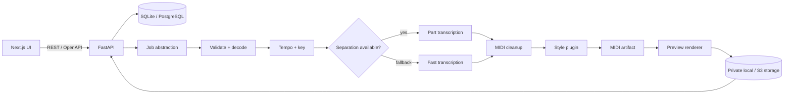

# TuneMorph architecture

## Goals

TuneMorph is organised around replaceable boundaries rather than one transcription
model. The HTTP layer schedules work and owns project state; the audio engine owns
musical operations; storage owns binary artifacts. This permits a local development
stack today and PostgreSQL, S3, and a distributed queue later without rewriting DSP.



## Package boundaries

`tunemorph_audio.contracts` defines asynchronous abstract interfaces for separation,
transcription, tempo/key detection, post-processing, style transformation, and preview
rendering. Adapters may use a subprocess only with an argument array and `shell=False`.
The backend depends on these interfaces but DSP code never imports FastAPI.

The OpenAPI document is the external contract. Frontend code will consume a generated
client once processing resources are available. Project binary data is not exposed via
a static file mount: authenticated/authorised download handlers will stream artifacts.

## Planned project lifecycle

Jobs move monotonically through `pending`, `uploading`, `analyzing`, `separating`,
`transcribing`, `post_processing`, `styling`, `rendering`, then `completed` or `failed`.
Progress is reported only at completed boundaries or where an adapter supplies measured
progress. A high-quality separation failure records a warning and enters the fast path.

Each random UUID project owns:

```text
data/projects/<uuid>/
├── source/
├── analysis/
├── stems/
├── midi/
├── preview/
└── metadata.json
```

Original filenames remain metadata and never become paths. Uploads will be streamed with
hard byte limits, checked against an allowlist of extensions and media signatures, and
decoded with `ffprobe` before acceptance. Retention cleanup defaults to 24 hours.

## Style semantics

Fidelity controls how strongly timing, harmony, and structure are preserved: 100 aims
for maximal preservation, while 0 permits a stronger but coherent reinterpretation.
Complexity controls note density and harmonic detail: 100 retains richer voicings and
accompaniment, while 0 prioritises an essential melody and minimal harmony.

Style transformations operate on musical events and do not merely change a General MIDI
program. Plugin registration is isolated under `tunemorph_audio.styles`.

## Operational evolution

The initial deployment uses in-process background work, SQLite, and filesystem storage.
Repository/service abstractions introduced with projects keep SQLAlchemy compatible with
PostgreSQL; storage keys remain relative so an S3 implementation can replace local I/O;
and the queue boundary can be backed by ARQ, RQ, Celery, or another worker system.
